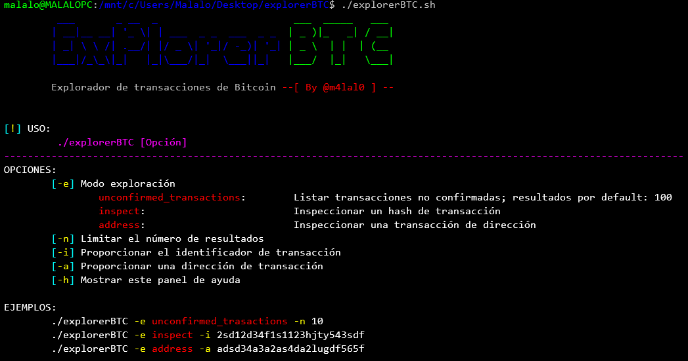
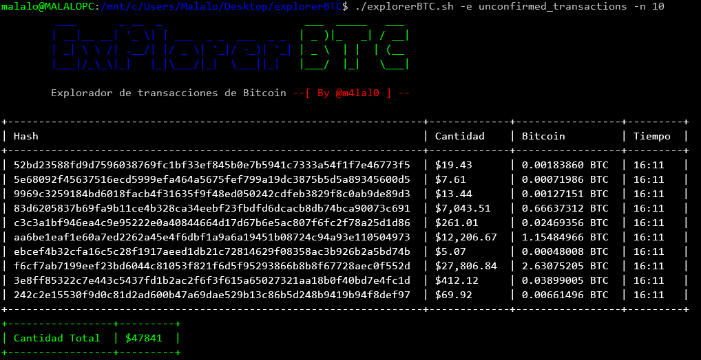
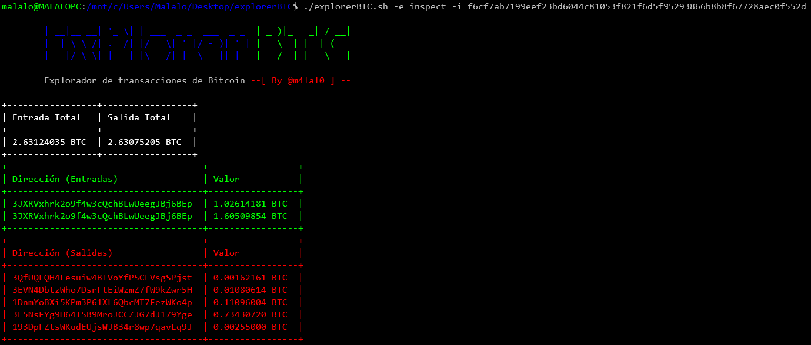
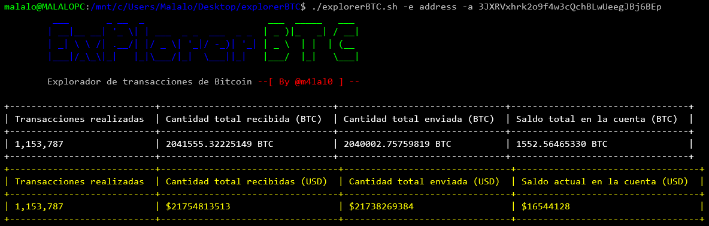

# explorerBTC
<p align="center" style="color:#4169e1">
┏━━━┓━━━━━━━━┏┓━━━━━━━━━━━━━━━┏━━┓━┏━━━━┓┏━━━┓
┃┏━━┛━━━━━━━━┃┃━━━━━━━━━━━━━━━┃┏┓┃━┃┏┓┏┓┃┃┏━┓┃
┃┗━━┓┏┓┏┓┏━━┓┃┃━┏━━┓┏━┓┏━━┓┏━┓┃┗┛┗┓┗┛┃┃┗┛┃┃━┗┛
┃┏━━┛┗╋╋┛┃┏┓┃┃┃━┃┏┓┃┃┏┛┃┏┓┃┃┏┛┃┏━┓┃━━┃┃━━┃┃━┏┓
┃┗━━┓┏╋╋┓┃┗┛┃┃┗┓┃┗┛┃┃┃━┃┃━┫┃┃━┃┗━┛┃━┏┛┗┓━┃┗━┛┃
┗━━━┛┗┛┗┛┃┏━┛┗━┛┗━━┛┗┛━┗━━┛┗┛━┗━━━┛━┗━━┛━┗━━━┛
━━━━━━━━━┃┃━━━━━━━━━━━━━━━━━━━━━━━━━━━━━━━━━━━
━━━━━━━━━┗┛━━━━━━━━━━━━━━━━━━━━━━━━━━━━━━━━━━━
<br>
**¿Quieres saber cuánto dinero en Bitcoin se mueve por el mundo?**
</p>

La herramienta explorerBTC hecha en Bash es ideal para explorar las transacciones en el servicio de Bitcoin, conocido como Blockchain (blockchain.com).

## ¿Cómo funciona la herramienta?
Para ejecutar la herramienta colocamos lo siguiente:
```bash
# ./explorerBTC
```
Tras ejecutar la herramienta, veremos el menú de ayuda:

<p align="center">

</p>

La herramienta cuenta con 3 modos de exploración:

* unconfirmed_transactions
* inspect
* address

El modo de exploración **unconfirmed_transactions**, nos permite listar las transacciones que se están realizando en tiempo real, pudiendo indicar a través del parámetro '**-n**' el número de transacciones totales a representar, ya que por default nos arrojará 100 resultados:

<p align="center">

</p>

El modo de exploración **inspect** y haciendo necesario el uso del parámetro '**-i**', nos permite inspeccionar una transacción, colocando el identificador de la transacción:

<p align="center">

</p>

En caso de querer investigar las direcciones involucradas (tanto de entrada y de salida) en la transacción, a través del modo de exploración **address** y haciendo uso del parámetro '**-a**' para especificar la dirección, podremos listar la información más relevante de la dirección especificada:

<p align="center">

</p>